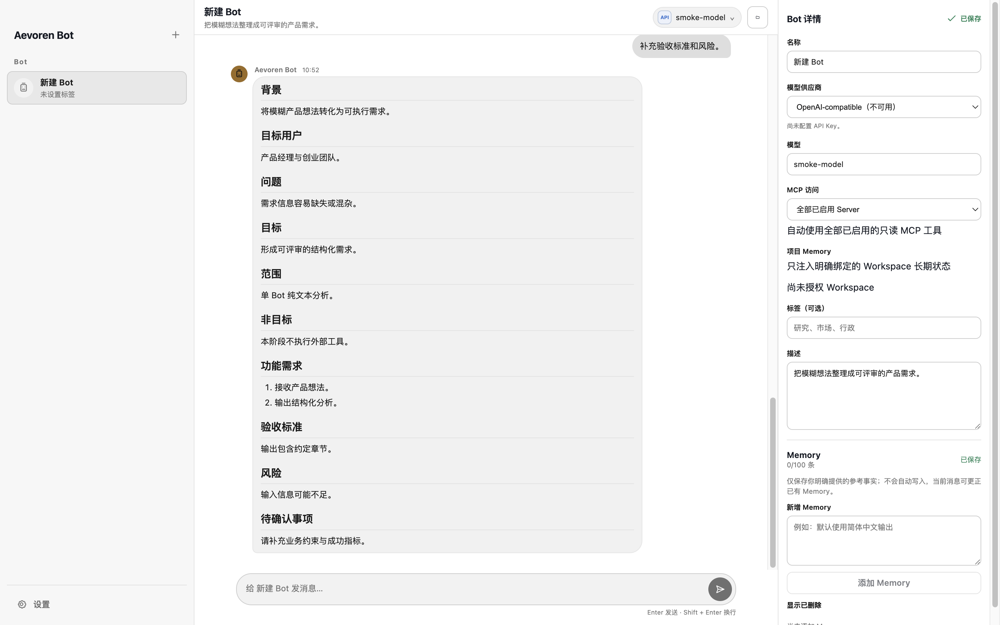

# Aevoren Bot

[简体中文](README.zh-CN.md) | English

[](https://github.com/CMSKL/Aevoren-Bot/actions/workflows/ci.yml)

<p></p>



Start with the [project portal](docs/PORTAL.md), [installation guide](docs/INSTALLATION.md), or [user guide](docs/USER_GUIDE.md).

Aevoren Bot is a local-first desktop messenger for persistent AI contacts and bounded multi-Agent collaboration. Chats, Contacts and Workspaces organize conversations, reusable Bots and local project files. Conversations, reviewed Memory, tool approvals and runtime recovery stay on the user's computer, with API, Claude Code or Codex CLI as the model source.

> **Pre-release status:** signed macOS Beta binaries are distributed through [GitHub Releases](https://github.com/CMSKL/Aevoren-Bot/releases). macOS 13+ on Apple silicon is the signed release target; Windows 10/11 x64 remains in the Windows MVP validation track. Do not treat local unsigned builds as official releases.

## Highlights

- Reliable streamed conversations backed by SQLite Transcript, Send Journal, stable nonces, idempotent retry, cancellation, and crash recovery.
- Bounded text/code attachments, validated ingestion, and real Markdown/CSV deliverables collected in task details.
- Independent chat state and Agent identities: recent conversations, global contacts, unread replies, and separate remove-chat, clear-history and delete-contact actions.
- Direct Bot chats and 2–6 member Rooms with explicit `@Bot`, automatic owner selection, bounded handoff, speaker identity, and loop suppression.
- Optional fixed group coordinators assign ordered member work and summarize verified results once. Explicit mentions and Everyone remain independent replies; failed work can be retried without repeating completed outputs.
- First-phase model support for a manually configured OpenAI-compatible API, automatically discovered Claude Code, and automatically discovered Codex CLI.
- Codex App Server Dynamic Tools routed through Aevoren's explicit Approval and Tool Journal boundary.
- User-, Bot-, and Workspace-scoped long-term Memory with non-blocking reviewed capture; model suggestions stay pending until the user accepts them.
- User-authorized Workspace list/read/search plus opt-in, create-only Markdown/CSV artifacts; existing files cannot be overwritten.
- Content teams expose contextual Brief decisions, structured failure recovery, verified execution evidence, and delivery-file status; model text alone never appears as successful tool execution.
- Read-only time, weather, public web search, safe public HTTPS page reading, and reviewed MCP tools.
- MCP stdio and Streamable HTTP support with OAuth 2.1/PKCE, encrypted credentials, per-Bot scope, exact tool review, and one-time approval.
- One-time, interval, and cron Routines with history, notifications, background window behavior, and optional macOS login startup.
- Sandboxed Renderer, typed Preload API, encrypted secrets, bounded tool inputs, private-network rejection, and signed/notarized release gates.

## Supported platform

| Platform | Status |
| --- | --- |
| macOS 13+ on Apple silicon | Supported development and release target |
| Intel macOS | Not tested or released |
| Windows 10/11 x64 | Windows MVP source/smoke/package target; signed public installer pending certificate setup |
| Linux | Not tested or released |
| Mobile | Not implemented |

## Run from source

Requirements:

- Node.js 24;
- pnpm 11.19.0;
- Xcode Command Line Tools on macOS, or PowerShell on Windows;
- macOS 13 or newer on Apple silicon, or Windows 10/11 x64.

```bash
git clone https://github.com/CMSKL/Aevoren-Bot.git
cd Aevoren-Bot
pnpm install --frozen-lockfile
AEVOREN_BOT_FAKE_PROVIDER=1 pnpm dev
```

The Fake Provider is deterministic and requires no account or API key. See [Installation](docs/INSTALLATION.md) for source builds, local packages, data isolation, and uninstall guidance.

## Configure a model

Open **Settings → Models & CLI**. Aevoren Bot scans common installation locations and `PATH` for supported CLIs and reads only the installation, login, and model information required by the corresponding adapter.

- **API:** OpenAI-compatible Base URL, API Key, model discovery, and real request validation.
- **Claude Code:** model/login discovery and conversations; compatible API-authenticated installations can use six scoped Workspace and public-web tools. Subscription-only OAuth tool mode is not supported yet.
- **Codex CLI:** model discovery, text conversations, and host Dynamic Tool support.

Other Provider and CLI adapters are outside the first-phase product scope and are not exposed in the model UI.

Saved API keys and OAuth credentials are encrypted by Electron `safeStorage` and are not returned to the Renderer. See [Configuration](docs/CONFIGURATION.md) for MCP, Workspace, Routine, and environment-variable details, and [Memory architecture](docs/MEMORY.md) for reviewed capture and scope rules.

Open **Chats** to resume direct or group conversations, **Contacts** to message or manage an Agent, and **Workspaces** to organize project files and related chats. The **+** beside Workspace selects a local folder; choosing the same folder reuses it. Agents can join groups across projects, while each chat has its own file-access scope. New ordinary chats start without a folder; select **Current chat workspace** in chat details to bind one. Existing chats retain their previous authorized-folder snapshot. Removing a chat keeps its history and contact; clearing history preserves the contact, approved Memory and local files.

## Security model

- Renderer processes use context isolation, sandboxing, no Node integration, and no WebView.
- The Preload exposes only declared, schema-validated capabilities; it does not expose raw IPC, SQLite, shell, or unrestricted filesystem APIs.
- Workspace access is explicit; users may optionally persist bounded Workspace automation and public read-only network approval. Clipboard and trusted MCP calls remain per-call approvals.
- Remote URLs reject embedded credentials, unsafe schemes, private-network targets, redirects, and oversized responses.
- Third-party MCP `readOnlyHint` metadata is not trusted automatically; exact tool names require user review.
- Web, MCP, CLI, and model output is treated as untrusted data and does not override system or user authority.
- Automatic updates are disabled in development and in packages without a trusted embedded feed.

Read [SECURITY.md](SECURITY.md) before reporting a vulnerability. Never post API keys, OAuth tokens, private transcripts, databases, or personal paths in public Issues.

## Development commands

```bash
pnpm typecheck
pnpm lint
pnpm test
pnpm build
pnpm test:smoke
pnpm licenses:check
pnpm security:audit
```

The standard non-interactive gate is:

```bash
pnpm verify
```

Electron smoke tests use hidden windows and temporary user-data directories. A local unsigned macOS package can be created with `pnpm package:mac`; it is not a distributable release.

For Windows x64 source validation, use `pnpm package:win`. This creates an unsigned NSIS installer for CI/development checks; the signed installer is produced only by the Windows release workflow after `WIN_CSC_LINK` and `WIN_CSC_KEY_PASSWORD` are configured. Use `pnpm package:win:dir` when an unpacked directory is needed for diagnostics.

## Data and privacy

Application data is stored locally in Electron's user-data directory. Aevoren Bot stores Bots, Rooms, transcripts, explicit Memory, settings, Tool Journal metadata, and Routine history in SQLite. Secret values are stored separately through `safeStorage`.

Models and enabled external services receive only the context and tool inputs required for the user's request. Aevoren Bot does not provide cloud sync, multi-user accounts, billing, remote desktop, unrestricted shell, arbitrary file overwrite/delete, unreviewed automatic Memory writes, or write-capable MCP tools in the current release line. Workspace writes are limited to new UTF-8 Markdown/CSV files in explicitly writable roots. Users can also export a completed reply through the system save dialog.

## Contributing and support

- [Project portal](docs/PORTAL.md)
- [User guide](docs/USER_GUIDE.md)
- [Troubleshooting](docs/TROUBLESHOOTING.md)
- [Contributing guide](CONTRIBUTING.md)
- [Support policy](SUPPORT.md)
- [Security policy](SECURITY.md)
- [Code of Conduct](CODE_OF_CONDUCT.md)
- [Changelog](CHANGELOG.md)
- [Third-party notices](THIRD_PARTY_NOTICES.md)
- [Trademark notice](TRADEMARKS.md)
- [Open-source release checklist](docs/OPEN_SOURCE_CHECKLIST.md)
- [Roadmap](ROADMAP.md)

Development follows `dev` → `beta` → `master`. Contributor pull requests should target `dev`. Release tags are created only after branch promotion and validation; see [Release Process](docs/RELEASING.md) and [Automatic Update Design](docs/plans/automatic-updates.md).

## License

Aevoren Bot is licensed under the [Apache License 2.0](LICENSE). The project name and icon remain subject to the separate [trademark notice](TRADEMARKS.md).
