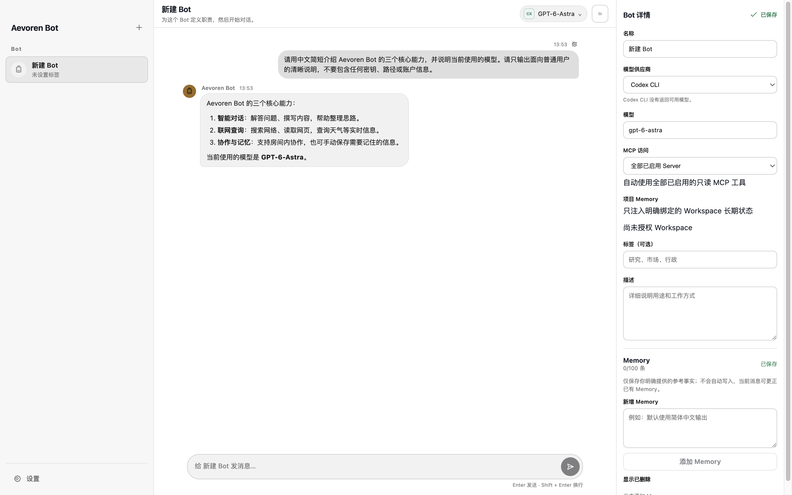

# Aevoren Bot

简体中文 | [English](README.md)

[](https://github.com/CMSKL/Aevoren-Bot/actions/workflows/ci.yml)

<p></p>



请先阅读[项目门户](docs/PORTAL.md)、[安装指南](docs/INSTALLATION.md)或[用户指南](docs/USER_GUIDE.md)。

Aevoren Bot 是一个本地优先的 macOS AI Bot 工作台，用于持久化 Bot 对话和有边界的多 Bot 协作。对话、显式 Memory、工具审批、Tool Journal 和运行恢复都保存在用户自己的电脑上。

> **预发布状态：** 当前公开的是开发中的源码，尚未发布正式二进制版本。支持目标为 macOS 13+ Apple silicon；本地未签名构建不代表官方发行版。

## 核心能力

- 基于 SQLite Transcript、Send Journal、稳定 Nonce、幂等重试、取消和崩溃恢复的流式对话。
- 单 Bot 对话和 2–6 个成员的 Room，支持显式 `@Bot`、自动 owner 选择、边界内 handoff、speaker 身份和循环抑制。
- 自动发现 Codex CLI、Claude Code、Ollama 和支持的 ACP CLI，并提供 OpenAI-compatible 兜底。
- Codex App Server Dynamic Tools，通过显式 Approval 和 Tool Journal 边界接入。
- User、Bot、Workspace 作用域的显式 Memory，模型不能静默写入长期 Memory。
- 用户授权的只读 Workspace 列表/读取/搜索和有界剪贴板访问。
- 只读时间、天气、有限 Wikipedia 搜索、安全的公开 HTTPS 页面读取和经过审查的 MCP 工具。
- MCP stdio 和 Streamable HTTP，支持 OAuth 2.1/PKCE、加密凭据、Bot 作用域、精确工具审查和一次性审批。
- 一次性、间隔和 cron Routine，包含历史、通知、后台窗口行为和可选 macOS 登录启动。
- 沙箱 Renderer、类型化 Preload API、加密密钥、有界工具输入、私网拒绝以及签名/公证发布门禁。

## 支持平台

| 平台 | 状态 |
| --- | --- |
| macOS 13+ Apple silicon | 当前开发和发行目标 |
| Intel macOS | 未测试、未发行 |
| Windows / Linux | 未测试、未发行 |
| Mobile | 尚未实现 |

## 源码运行

要求：

- Node.js 24；
- pnpm 11.19.0；
- Xcode Command Line Tools；
- macOS 13 或更高版本，Apple silicon。

```bash
git clone https://github.com/CMSKL/Aevoren-Bot.git
cd Aevoren-Bot
pnpm install --frozen-lockfile
AEVOREN_BOT_FAKE_PROVIDER=1 pnpm dev
```

Fake Provider 是确定性的，不需要账号或 API Key。源码构建、数据隔离和卸载说明见[安装指南](docs/INSTALLATION.md)。

## 模型配置

打开**设置 → 模型与 CLI**。Aevoren Bot 会扫描常见安装目录和 `PATH`，只读取对应适配器所需的 CLI 安装、登录和模型信息。

- **Codex CLI：** 模型发现和宿主 Dynamic Tool 支持；
- **Claude Code：** 登录和模型发现，以及文本对话；
- **Ollama：** 本地安装模型发现和文本对话；
- **ACP CLI：** 在协议支持范围内发现模型并进行文本对话；
- **OpenAI-compatible：** 手动 Base URL 和 API Key 兜底。

保存的 API Key 和 OAuth 凭据由 Electron `safeStorage` 加密，之后不会返回给 Renderer。MCP、Workspace、Memory、Routine 和环境变量说明见[配置指南](docs/CONFIGURATION.md)。

## 安全模型

- Renderer 使用 Context Isolation、Sandbox、无 Node Integration 和无 WebView。
- Preload 只暴露声明并经过 Schema 校验的能力，不暴露原始 IPC、SQLite、Shell 或无限制文件系统。
- Workspace、剪贴板、网络和受信任的只读 MCP 调用需要明确审批。
- 远程 URL 拒绝内嵌凭据、不安全协议、私网地址、危险重定向和超大响应。
- 第三方 MCP 的 `readOnlyHint` 不会被自动信任；具体工具名称必须经过用户审查。
- Web、MCP、CLI 和模型输出都被视为不可信数据，不能覆盖系统或用户权限。
- 开发环境和没有可信更新 feed 的本地包会禁用自动更新。

报告漏洞前请阅读 [SECURITY.md](SECURITY.md)。不要在公开 Issue 中发布 API Key、OAuth Token、私人 Transcript、数据库或个人路径。

## 开发命令

```bash
pnpm typecheck
pnpm lint
pnpm test
pnpm build
pnpm test:smoke
pnpm licenses:check
pnpm security:audit
```

标准非交互门禁：

```bash
pnpm verify
```

Electron Smoke 使用隐藏窗口和临时用户数据目录。`pnpm package:mac` 生成的本地未签名 macOS 包只用于开发验证，不是可分发发行版。

## 数据和隐私

应用数据存储在 Electron 的 user-data 目录。Aevoren Bot 会在 SQLite 中保存 Bot、Room、Transcript、显式 Memory、设置、Tool Journal 元数据和 Routine 历史；密钥值通过 `safeStorage` 单独存储。

模型和启用的外部服务只会收到完成用户请求所需的上下文和工具输入。当前版本不提供云同步、多用户账号、计费、远程桌面、无限制 Shell、文件写入、自动 Memory synthesis 或可写 MCP 工具。

## 文档、贡献和支持

- [项目门户](docs/PORTAL.md)
- [用户指南](docs/USER_GUIDE.md)
- [故障排查](docs/TROUBLESHOOTING.md)
- [配置指南](docs/CONFIGURATION.md)
- [安装指南](docs/INSTALLATION.md)
- [贡献指南](CONTRIBUTING.md)
- [支持政策](SUPPORT.md)
- [安全政策](SECURITY.md)
- [行为准则](CODE_OF_CONDUCT.md)
- [变更记录](CHANGELOG.md)
- [第三方许可清单](THIRD_PARTY_NOTICES.md)
- [商标说明](TRADEMARKS.md)
- [开源检查清单](docs/OPEN_SOURCE_CHECKLIST.md)
- [Roadmap](ROADMAP.md)

开发流程为 `dev` → `beta` → `master`。贡献者 PR 应提交到 `dev`；只有完成分支晋级和验证后才创建 Release Tag，详见[发布流程](docs/RELEASING.md)和[自动更新设计](docs/plans/automatic-updates.md)。

## 许可证

Aevoren Bot 使用 [Apache License 2.0](LICENSE) 开源。项目名称和图标仍受独立的[商标说明](TRADEMARKS.md)约束。
